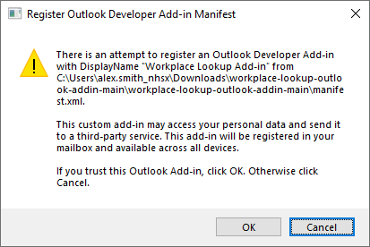
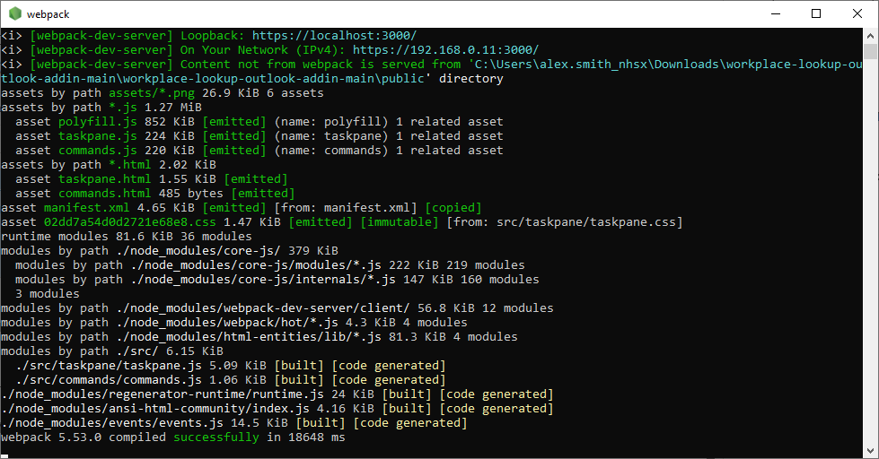
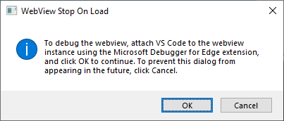
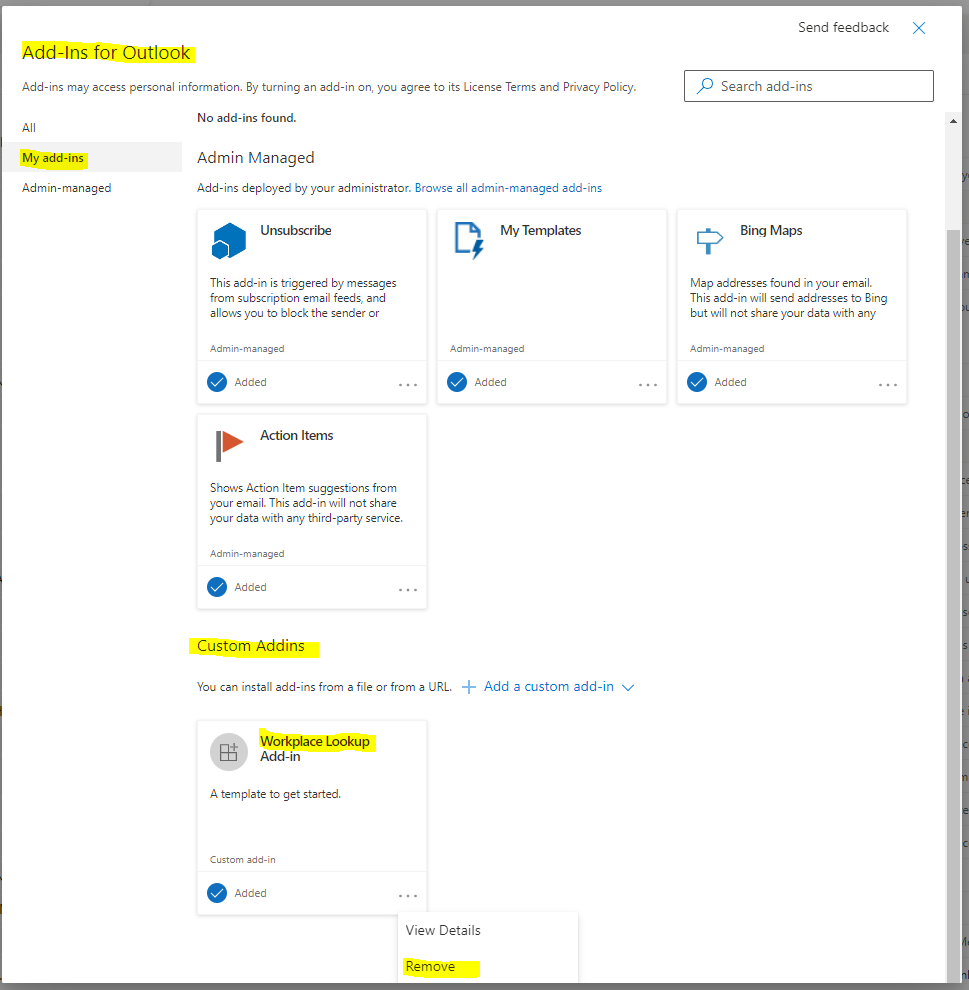

# workplace-lookup-outlook-addin
MS Office javascript add-in, the adds an integration to the internal Workplace directory to lookup contacts on mail and other outlook items.

Follows the patten described here: [Build your first Outlook add-in](https://docs.microsoft.com/en-us/office/dev/add-ins/quickstarts/outlook-quickstart?tabs=yeomangenerator)

## Pre-requisites

In order to use this add-in you must "sideload" it and run it in a local Node instance, along side your Outlook client, to do this you need to have Node running locally.

- Latest version of [Node](https://nodejs.org/en/)
- If you can install applications on your client then download and run the installer
- If you don't have permissions to install applications on your client then download the [binaries](https://nodejs.org/en/download/)
  - Extract the binaries onto your local disk
  - Add the path to the `node.exe` to your local path variable so you can run it from the command line
  - To do this permanently in PowerShell [modify the local PowerShell profile](https://stackoverflow.com/a/714918/470183) 
    
- Run the following command to check you have node and npm installed:
  
  ```PowerShell
  node -v
  npm -v
  ```
  
## Installation

1. Download the zipped code from this repository
   
   
   
1. Extract the code to a folder on your local disk 
1. Open a command line, e.g. PowerShell on Windows
1. Navigate to the extracted folder (note this may be one folder down from the folder created when the file was extracted)
   
   ```PowerShell
   cd .\projects\workplace-lookup-outlook-addin-main\
   ```

1. Restore all the node modules

   ```PowerShell
   npm install
   ```
   
1. Open the Outlook client
1. Start the dev server and sideload the add-in
   
   ```PowerShell
   npm start
   ```
   
1. When prompted to allow localhost loopback, say no "n"
   
   ```PowerShell
   ? Allow localhost loopback for Microsoft Edge WebView? (Y/n)  n
   ```
   
1. If you are prompted to install a certificate after you run one of the following commands, accept the prompt to install the certificate
1. You will be prompted that an add-on is trying to load into Outlook, click OK
   
   
1. Once the node development server has started you should see a new terminal window open

   
   
2. In Outlook open a message and click on the "Workplace Lookup" button in the toolbar ribbon
3. You will see a debug warning, click Cancel to not see the warning again
   
   
   
4. You should now see a list of links for contacts in the message, click on the links to be taken to the internal workplace directory and search for the contact:
   
   
   
## Stopping and uninstalling the add-in

To stop the add-in close the node development server window (webpack).

To completely uninstall it, in Outlook go to File > Manage Add-ins, this will open the Manage Add-ins pop-up in Outlook 365 on the web. From the "My add-ins tab", select the "Workplace Lookup" add-in and click "Remove".



## See Also

- [Build your first Outlook add-in](https://docs.microsoft.com/en-us/office/dev/add-ins/quickstarts/outlook-quickstart?tabs=yeomangenerator)
- [Sideload an Outlook add-in](https://docs.microsoft.com/en-us/office/dev/add-ins/outlook/sideload-outlook-add-ins-for-testing?tabs=windows)
 
